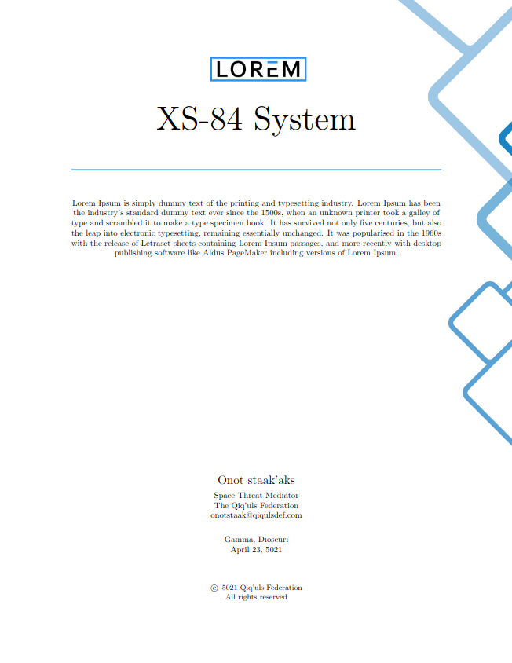
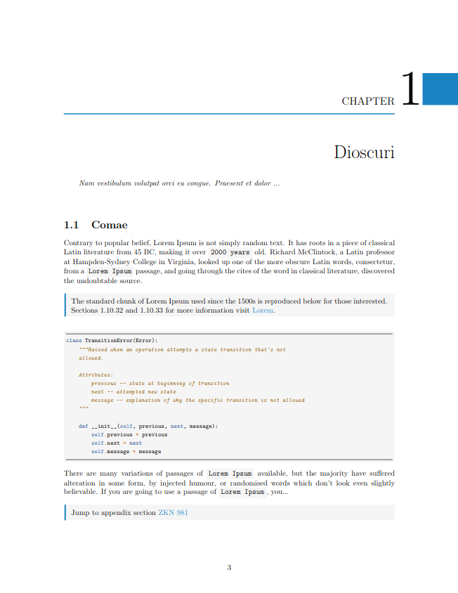

# QL413

This is a simple LaTeX setup that I recently made for a document that required nice notes, code snippets, diagrams, etc.

### Preview

Check [pdf](preview/main.pdf).

|         Title Page          |         Chapter Page          |
| :-------------------------: | :---------------------------: |
|  |  |

Credits:

- Title page [decoration](https://tex.stackexchange.com/a/85989).
